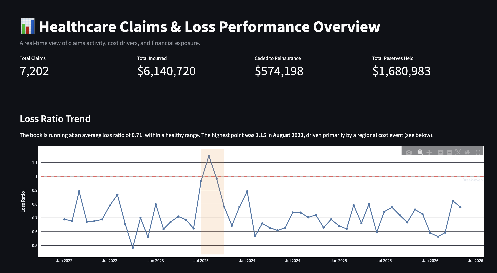
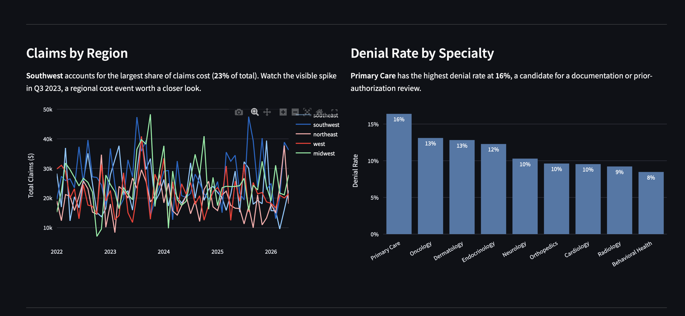
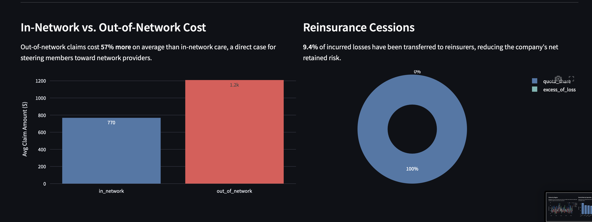

# 🏥 Healthcare Claims & Loss Performance Platform

*A Databricks project that turns health insurance claims into a live dashboard showing profitability, cost trends, and risk.*


---

## 📑 Table of Contents

- [Business Problem](#-business-problem)
- [Overview](#-overview)
- [Dashboard](#-dashboard)
- [Architecture](#️-architecture)
- [Tech Stack](#️-tech-stack)
- [Dataset](#-dataset)
- [Pipeline Details](#️-pipeline-details)
- [Key Insights](#-key-insights)
- [Key Results](#-key-results)
- [Project Structure](#-project-structure)
- [Future Scope](#-future-scope)
- [Deployment Note](#-deployment-note)

---

## 🎯 Business Problem

This project processes health insurance claims through a governed, layered data pipeline on Databricks, then adds a **finance/actuarial module** on top: claim reserving (setting money aside for future payouts, including claims not yet reported) and reinsurance ceding (passing part of the cost of large or risky claims onto another insurance company, modeled two different ways depending on the type of contract in place).

**Use case:** A claims operations lead and a finance/actuarial analyst both need to answer questions from the same underlying data, without either seeing what the other shouldn't:

1. Is the company collecting more in premiums than it's paying out in claims, and is that trend improving or getting worse?
2. Which regions, specialties, or providers are driving cost, and is a cost spike a one-off event or a pattern?
3. How much risk has been shifted onto other insurance companies, and how much money is still being held in reserve for claims we expect to pay later?

This project demonstrates that exact workflow end to end: claims data flows through a governed medallion architecture, splits into persona scoped Gold layers, and surfaces directly in an executive dashboard a finance lead could use to make a real underwriting or network-contracting decision. In this case, catching a 62% cost spike in one region during a three-month window, and confirming out-of-network care runs 57% more expensive per claim.

---

## 📘 Overview


**Key Highlights:**

- 🏗️ Full Bronze-Silver-Gold medallion architecture on Unity Catalog, with Gold split into two schemas by persona (Claims Ops vs. Finance/Actuarial)
- 🔄 Lakeflow Declarative Pipelines with `APPLY CHANGES INTO` for SCD Type 1 (providers) and SCD Type 2 (members, treaties)
- ⚡ Liquid Clustering on the claims fact table, declared inline in the materialized view definition
- 🔐 Column-level PHI masking and a documented (though disabled-by-default, for a single-user account) row-level region filter
- 🤖 `ai_query()` against Databricks Foundation Model APIs for claim-note summarization and classification
- 📊 An executive Streamlit dashboard, deployed as a Databricks App.
- 💰 Built and verified entirely on **Databricks Free Edition** at $0 cost. Documented in [`BUDGET_GUIDE.md`](./BUDGET_GUIDE.md)

---

## 📖 Plain-English Glossary

A few insurance terms come up throughout this README. Quick definitions, if you don't work in insurance :)

| Term | Plain-English meaning |
|---|---|
| **Loss ratio** | Cents paid out in claims for every dollar collected in premiums. A loss ratio of 0.71 means 71 cents of every premium dollar went to claims, leaving 29 cents for expenses and profit. Above 1.0 means the company paid out more than it collected. |
| **Reserves** | Money set aside now for claims expected to be paid later, even before the final bill arrives. |
| **IBNR (Incurred But Not Reported)** | A specific kind of reserve for events that have already happened but haven't been filed as a claim yet, so nobody's billed for them yet. |
| **Reinsurance** | Insurance for insurance companies. A health insurer can pass part of a large or risky claim's cost onto another company (a "reinsurer") in exchange for a fee, so no single claim can bankrupt them. |
| **Ceding / ceded** | The act of passing that risk (and cost) to a reinsurer. "Ceded to reinsurance" = the dollar amount handed off. |
| **Treaty** | The contract between the insurer and the reinsurer that spells out how much risk gets shared and under what terms. |
| **PHI** | Protected Health Information, patient-level medical detail that's legally sensitive and access-controlled. |

---

## 📸 Dashboard

### KPIs and Loss Ratio Trend



### Regional and Specialty Breakdown



### Network Cost and Reinsurance



> **Note on public access:** Databricks Apps cannot be made publicly viewable. Anonymous, no-login sharing isn't supported on any tier. There's no live link to share here; the screenshots above are the actual, unedited output of the deployed app.

---

## 🏗️ Architecture

```
Source Systems (claims engine, enrollment, provider directory,
adjuster notes, reinsurance treaty register, premium billing)
       │
       ▼
Unity Catalog Volume (landing zone)  ──►  Auto Loader (cloudFiles)
       │
       ▼
Bronze Layer  ──►  8 raw tables, schema-on-read
       │
       ▼
Lakeflow Silver Layer  ──►  claims_staging, members_scd2 (SCD2),
                            providers_current (SCD1), claim_status_current,
                            reinsurance_treaties (SCD2), premium_ledger
       │
       ▼
Gold: Claims Ops                Gold: Finance / Actuarial
claims_fact (clustered,        reserves_fact, reinsurance_cession_fact,
PHI-masked), provider          loss_ratio_mart, combined_ratio_mart
performance, ai_query notes    (separate schema, separate grants)
       │
       ▼
Streamlit Dashboard (Databricks App)
```

Full diagram and the persona/access-split rationale: [`diagrams/architecture.md`](./diagrams/architecture.md).

---

## 🛠️ Tech Stack

| Layer | Technology |
|---|---|
| Storage & table format | Delta Lake |
| Governance & catalog | Unity Catalog (schemas, column masks, lineage) |
| Ingestion | Auto Loader (`cloudFiles`) |
| Transformation | Lakeflow Declarative Pipelines, PySpark |
| Compute | Databricks Serverless SQL Warehouse |
| AI / LLM | `ai_query()` against Databricks Foundation Model APIs |
| Visualization | Streamlit, deployed as a Databricks App |
| Language | Python 3.11, SQL |

---

## 📦 Dataset

- **Source:** fully synthetic, generated by [`data_generator.py`](./data_generator.py). No real PHI.
- **Size (at `--scale 0.001`, the budget-friendly default):** ~7,200 claims, ~690 member-plan-event rows, 25 providers, ~26,500 premium transactions
- **Calibration:** claim amounts, premium levels, and denial rates are deliberately calibrated against each other so the resulting loss ratio lands in a realistic ~0.65–0.85 band, rather than being arbitrary.

---

## ⚙️ Pipeline Details

### Bronze Layer

- Auto Loader (`cloudFiles`) reads parquet files from a Unity Catalog Volume landing zone into 8 Bronze tables
- Schema-on-read with a `_rescued_data` column, so upstream schema drift never breaks ingestion
- `.trigger(availableNow=True)`: processes whatever's currently landed, then stops cleanly

### Silver Layer

- `claims_staging`: typed, append-only streaming table (no CDC needed since Bronze claims are insert-only)
- `members_scd2`: `APPLY CHANGES INTO ... STORED AS SCD TYPE 2`. A claim must be judged against the plan a member had on the date of service, so history matters
- `providers_current`: `STORED AS SCD TYPE 1`. No history needed, network status just changes in place
- `reinsurance_treaties`: SCD Type 2. A cession must use the treaty terms in force on the claim date, not this year's renegotiated terms

### Gold Layer: Claims Ops

- `claims_fact`: the joined, curated fact table, Liquid Clustered on `(claim_date, provider_id)`, with `diagnosis_code` masked inline in the `SELECT` (PHI protection)
- `provider_performance_mart`: denial rate and billed amount by provider
- `claim_notes_enriched`: `ai_query()`-generated summaries and category classifications of adjuster notes

### Gold Layer: Finance / Actuarial

- `reserves_fact`: case reserve + IBNR at a `(claim, valuation_date)` grain, modeled as its own fact table since reserves are re-estimated periodically, not a static claim attribute
- `reinsurance_cession_fact`: excess-of-loss and quota-share modeled with genuinely different formulas, since they pay out differently
- `loss_ratio_mart` / `combined_ratio_mart`: incurred losses and earned premium are aggregated independently, then joined by period, so the ratio reflects true population-level totals

---

## 🔎 Key Insights

From the live dashboard, we see that,

- Overall, the company collects about $1.41 in premiums for every $1 it pays out in claims (a loss ratio of **0.71**), a healthy margin, with a clear spike to **1.15** (meaning payouts briefly exceeded premium income) during a regional cost event in **August 2023**
- **Southwest** carries the largest share of claims cost at **23%** of the total in this run
- **Primary Care** has the highest denial rate at **16%**, a candidate for a documentation or prior-authorization review
- Out-of-network claims cost **57% more** on average than in-network care
- **9.4%** of incurred losses have been transferred to reinsurers, reducing net retained risk

---

## 📈 Key Results

| Metric | Value |
|---|---|
| Total Claims | 7,202 |
| Total Incurred | $6,140,720 |
| Ceded to Reinsurance | $574,198 |
| Total Reserves Held | $1,680,983 |
| Average Loss Ratio | 0.71 |
| Peak Loss Ratio | 1.15 (Aug 2023) |
| Highest-Cost Region | Southwest (23% of total) |
| Highest Denial Rate | Primary Care (16%) |
| Out-of-Network Cost Premium | +57% vs. in-network |

---

## 📂 Project Structure

```
databricks-healthcare-finance-claims/
├── README.md
├── BUDGET_GUIDE.md
├── data_generator.py
├── screenshots/
│   ├── dashboard_01_kpi_loss_ratio.png
│   ├── dashboard_02_region_specialty.png
│   └── dashboard_03_network_reinsurance.png
├── notebooks/
│   ├── 01_setup_catalog_schemas.sql
│   ├── 02_bronze_ingestion.py
│   ├── 03_silver_transformations.sql
│   ├── 04_gold_claims_ops.sql
│   ├── 05_liquid_clustering_perf.sql
│   ├── 06_unity_catalog_governance.sql
│   ├── 07_finance_reserving.sql
│   ├── 07b_finance_reserving_pyspark.py
│   ├── 08_ai_query_claim_notes.sql
│   ├── 09_cost_monitoring_finops.sql
│   └── 10_time_travel_cloning.sql
├── pipelines/
│   └── lakeflow_pipeline.yml
├── diagrams/
│   └── architecture.md
└── streamlit_dashboard/
    ├── app.py
    ├── app.yaml
    └── requirements.txt
```

---

## 🔭 Future Scope

- Turn the loss ratio into an automated alert, not just a chart someone has to check, the pipeline already sends failure notifications (see `pipelines/lakeflow_pipeline.yml`); the same pattern could extend to business metrics, notifying the team automatically if the loss ratio crosses a set threshold, instead of waiting for someone to open the dashboard.
- Act on the AI classifications the pipeline already generates, `claim_notes_enriched` already tags notes as routine, denial, appeal, or fraud_flag using `ai_query()`, but nothing currently does anything with that tag. A natural next step is routing "fraud_flag" claims into a review queue automatically.
- Model multi-layer reinsurance, right now each claim is matched to a single treaty. Real reinsurance programs often stack several layers (one treaty covers losses up to a point, a second layer covers anything above that), which would extend the existing cession logic to walk a claim through more than one layer.
- Turn on the row-level security that's already written but disabled, `07_finance_reserving.sql` includes a region-based row filter, commented out because a single-user account has no groups to filter against. On a real multi-user workspace, this is a one-line change to activate.
- Add Lakeflow data-quality expectations (`EXPECT ... ON VIOLATION`) to every Silver table
- A proper actuarial review of the IBNR chain-ladder methodology, which is illustrative, not filing-grade.

---

## 📌 Deployment Note

This project is designed to run entirely on **Databricks Free Edition** at zero cost. Generate synthetic data locally (`python data_generator.py --out ./synthetic_data --scale 0.001`), upload it to a Unity Catalog Volume, then work through the notebooks in `notebooks/`. The Streamlit dashboard deploys as a Databricks App from the `streamlit_dashboard/` folder, with a SQL Warehouse resource attached.

Full step-by-step budget guidance: [`BUDGET_GUIDE.md`](./BUDGET_GUIDE.md).

---

*Built with Databricks · Delta Lake · Unity Catalog · Lakeflow Declarative Pipelines · PySpark · Streamlit · Databricks Apps*
